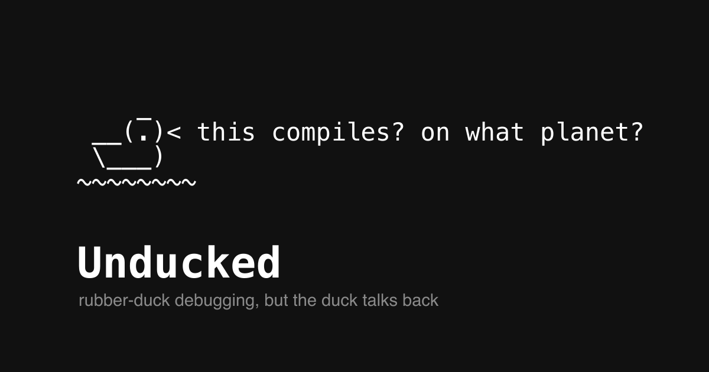

<h1> Unducked</h1>

Rubber-duck debugging, but the duck talks back. Paste your code and a foul-mouthed rubber duck reviews it like Gordon Ramsay reviews a risotto — it roasts you, then finds the actual bug and hands you the fix.

**🔗 Live: [unducked.com](https://unducked.com/)**

[](https://unducked.com/)

Built on the Strands Agents SDK, deployed on Amazon Bedrock AgentCore, hosted on GitHub Pages. The whole thing is one TypeScript file, a few CLI commands, and a single HTML page — the personality is just a system prompt.

## Architecture

```
Browser (unducked.com)
  → CloudFront + Lambda proxy   (public HTTPS; signs requests for the browser)
    → AgentCore Runtime          (hosted agent endpoint)
      → Strands Agent            (Chef Duck persona)
        → Bedrock (Claude Haiku 4.5)
```

Locally, the frontend skips the proxy and talks straight to `agentcore dev` on `localhost:8080`.

## Prerequisites

- AWS account with credentials configured
- Node.js 22+ and npm
- The AgentCore CLI: `npm install -g @aws/agentcore`
- Claude Haiku 4.5 access enabled in Bedrock

## Quick start (local)

```bash
# 1. Install the agent's dependencies
cd app/MyAgent && npm install && cd ../..

# 2. Start the local dev server (compiles + serves on http://localhost:8080)
agentcore dev

# 3. Open the frontend
open index.html
```

Paste some code, hit **Roast it**, and watch Chef Duck stream a review back.

## Deploy

```bash
# Deploy the agent to AWS
agentcore deploy

# Push to GitHub and enable Pages: Settings > Pages > Source: main branch, / (root)
git add . && git commit -m "ship the duck" && git push
```

The deployed AgentCore endpoint requires SigV4-signed requests, so a browser
can't call it directly. The `proxy/` folder holds a streaming Lambda (behind
CloudFront) that signs on the browser's behalf — see [DEPLOYMENT.md](DEPLOYMENT.md)
for the full setup and the gotchas (`x-amz-content-sha256`, the double invoke
permission, CORS preflight) that cost an afternoon.

## The duck's personality

Everything that makes it "Chef Duck" is the system prompt in `app/MyAgent/main.ts`.
Swap those few sentences and the same stack becomes a patient mentor, a
passive-aggressive senior dev, or a security auditor. The model didn't change —
the prompt did.

## Project structure

```
unducked/
├── app/MyAgent/
│   ├── main.ts               # The agent — Chef Duck persona + streaming server
│   ├── model/load.ts         # Which Bedrock model (Claude Haiku 4.5)
│   ├── package.json
│   └── tsconfig.json
├── index.html                # The UI — paste box, ASCII duck, streamed roast
├── proxy/                    # Streaming Lambda proxy for the public endpoint
├── starter/                  # Minimal, self-contained version for the walkthrough
├── assets/                   # Hero/OG image, favicon, logos
├── DEPLOYMENT.md             # How the public deployment actually works
├── blog-post.md              # The accompanying write-up
└── README.md
```

## Cost & safety

Claude Haiku 4.5 is ~$1/$5 per million tokens on Bedrock — fractions of a cent
per roast. The public endpoint is unauthenticated, so the Lambda proxy has a
reserved-concurrency cap (2) to bound spend. Add an AWS budget alarm if you
share it widely.

## License

MIT
