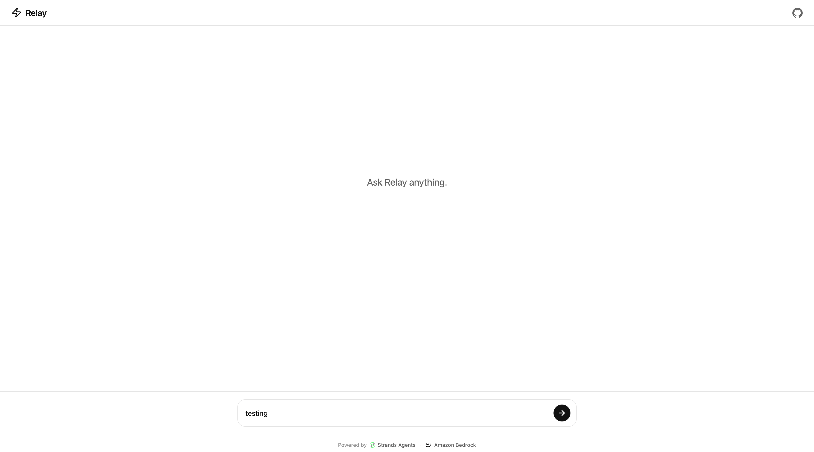

# Build Your Own ChatGPT with AWS

A minimal ChatGPT-style chat interface powered by the Strands Agents SDK and Amazon Bedrock AgentCore.

**🔗 Live demo: [tmoreton.github.io/tutorials](https://tmoreton.github.io/tutorials/)**

[](https://tmoreton.github.io/tutorials/)

## Architecture

```
index.html → AgentCore Runtime → Strands Agent → Bedrock (Amazon Nova Micro)
```

## Prerequisites

- AWS account with credentials configured
- Node.js 22+
- npm

## Quick Start

```bash
# 1. Install the AgentCore CLI
npm install -g @aws/agentcore

# 2. Install agent dependencies
cd app/MyAgent && npm install && cd ../..

# 3. Start the local dev server
agentcore dev

# 4. Open the frontend
open index.html
```

## Deploy

```bash
# Deploy the agent to AWS
agentcore deploy

# Push to GitHub and enable Pages: Settings > Pages > Source: main branch, / (root)
git add . && git commit -m "initial commit" && git push
```

The deployed AgentCore endpoint requires SigV4-signed requests, so the browser
can't call it directly. The `proxy/` folder holds a streaming Lambda (behind
CloudFront) that signs on the browser's behalf — see [DEPLOYMENT.md](DEPLOYMENT.md)
for the full setup and the gotchas involved.

## Project Structure

```
tutorials/
├── app/MyAgent/
│   ├── main.ts               # Agent code (streaming Strands + AgentCore app)
│   ├── model/load.ts         # Which Bedrock model (Nova Micro)
│   ├── package.json
│   └── tsconfig.json
├── index.html                # Chat UI (ChatGPT-style)
├── proxy/                     # Lambda proxy for the public endpoint
├── starter/                  # Minimal, self-contained version for the video tutorial
├── DEPLOYMENT.md             # How the public deployment actually works
├── blog-post.md              # The accompanying tutorial
└── README.md
```

## Blog Series

This repo accompanies the "Build Your Own ChatGPT" blog series on dev.to:

1. **Build Your Own ChatGPT in 30 Minutes** (this repo)
2. Add memory + a public endpoint
3. Add authentication
4. Chat with your documents (RAG)
5. Add guardrails
6. Give it tools
7. Go to production

## License

MIT
